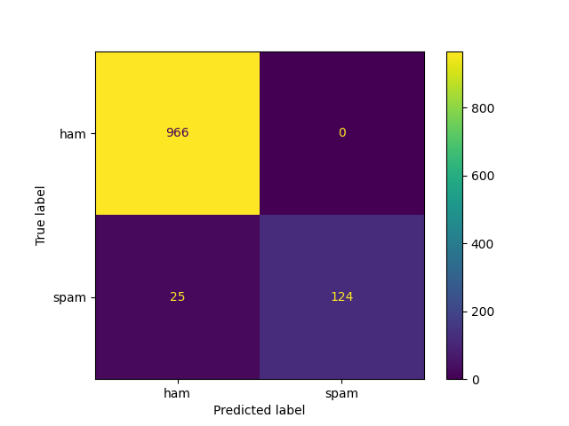

# SMS Spam Detection

This project focuses on classifying SMS messages as spam or ham. It helps users filter out unwanted messages.

## Dataset

The dataset is from Kaggle with 5,572 messages in total: 747 spam and 4,825 ham messages.

## Approach

I split the data into two parts: 80% for training and 20% for testing. I used TF-IDF to convert text into numerical features. I chose RandomForest with `class_weight='balanced'` due to class imbalance. I combined everything into a Pipeline.

## Results

- **Accuracy**: 98%
- **Precision (spam)**: 100%
- **Recall (spam)**: 84%



## How to Use

```python
import joblib

model = joblib.load('spam_model.pkl')
prediction = model.predict(['Your message here'])
print(prediction)
